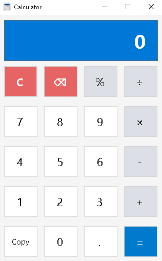
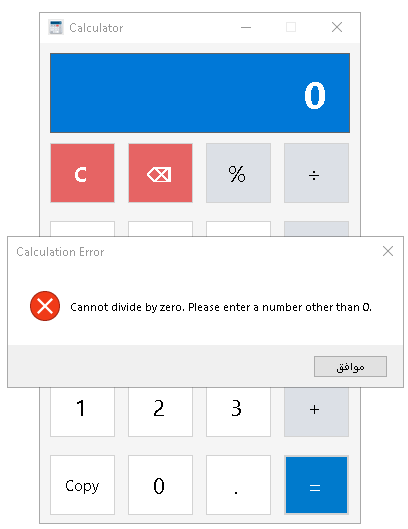

# Simple Calculator Project


[](https://docs.microsoft.com/en-us/dotnet/csharp/)
[](https://dotnet.microsoft.com/)
[](https://visualstudio.microsoft.com/)
[](https://docs.microsoft.com/en-us/dotnet/desktop/winforms/)

A clean, modern, and user-friendly desktop calculator application built using C# and .NET Framework 4.8 Windows Forms. The application features a custom UI design with dynamic color palettes, basic arithmetic operations, error validation, and clipboard integration.

---

## 📸 Screenshots

| Main UI | Error Handling (Divide by Zero) |
|:-------:|:--------------------------------:|
|  |  |

---

## ✨ Features

- **Basic Arithmetic Operations**: Perform Addition (`+`), Subtraction (`-`), Multiplication (`×`), Division (`÷`), and Modulus/Remainder (`%`).
- **Precision Floating Point Calculation**: Supports decimal numbers using double precision arithmetic.
- **Error Handling**: Graceful error management for invalid mathematical operations such as division by zero with custom alert dialogs.
- **Clipboard Copy Integration**: A dedicated **Copy** button allowing users to copy current calculation results directly to the Windows Clipboard.
- **Clear & Backspace Functions**:
  - `C`: Resets the entire calculator state and display to zero.
  - `⌫`: Deletes the last entered character/digit.
- **Custom UI Styling**: Clean, modern button layout with programmatic color styling for operators, action buttons, and display panel.

---

## 🛠️ Built With

- **Programming Language**: C#
- **Framework**: .NET Framework 4.8
- **UI Platform**: Windows Forms (WinForms)
- **IDE**: Visual Studio 2026

---

## 📂 Project Structure

```text
SimpleCalculatorProject/
├── docs/
│   └── screenshots/
│       ├── calculator-ui.png
│       └── calculation-error.png
├── Properties/
├── App.config
├── Form1.cs
├── Form1.Designer.cs
├── Form1.resx
├── Program.cs
├── AppIcon.ico
├── README.md
├── SimpleCalculatorProject.csproj
├── SimpleCalculatorProject.slnx
└── .gitignore
```

---

## 🚀 Getting Started

### Prerequisites

To build and run this project, you need:
- [Visual Studio 2022 / 2026 or newer version](https://visualstudio.microsoft.com/) with **.NET desktop development** workload installed.
- **.NET Framework 4.8 Runtime**.

### Installation & Execution

1. **Clone the repository**:
   ```bash
   git clone https://github.com/Abdullah-Shalgam/simple-calculator-project.git
   ```
2. **Open the project**:
   - Double-click `SimpleCalculatorProject.slnx` to launch Visual Studio.
3. **Build & Run**:
   - Press `F5` or click **Start** in Visual Studio.

---

## 📬 Contact & Developer Info

[](https://github.com/Abdullah-Shalgam)
[](https://www.linkedin.com/in/%D8%B9%D8%A8%D8%AF%D8%A7%D9%84%D9%84%D9%87-%D8%B4%D9%84%D8%BA%D9%88%D9%85-289506438)
[](https://instagram.com/abdullah_shalgam)
[](https://wa.me/2180931364346)
[](mailto:bdallhshlghwm500@gmail.com)

---

## 📝 License

Distributed under the MIT License. See `LICENSE` for more information.